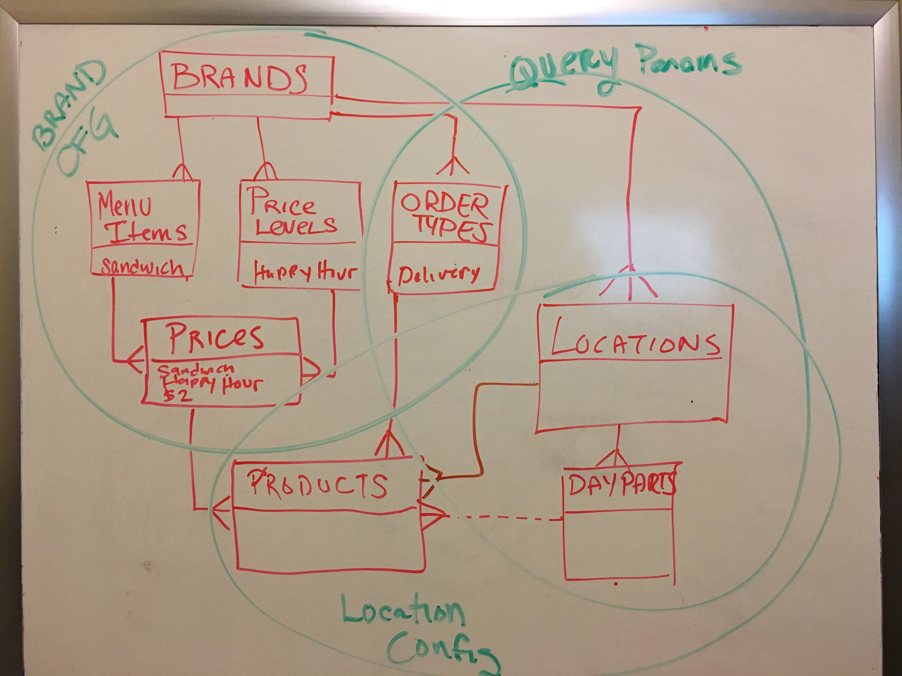

# salido


## Challenge Instructions

### Objective
Define and explain a set of data models that facilitate menu item pricing determined by a combination of 3 factors: restaurant location, order type, and time of day.

### Business Requirements
* Each restaurant **Brand** using the SALIDO platform has multiple **Locations**.
* Each **Brand** has various **Menu Items** that may be used by any of its **Locations** (e.g. Cafe Bangarang's FiDi and SoHo locations both sell a "Spicy Reuben").
* Each **Brand** has various **Price Levels** (e.g. "Regular" or "Happy Hour") that may be used by any of its **Locations**.
* Each **Menu Item** may have a price assigned for each available **Price Level** (e.g. Regular: $4, Happy Hour: $2).
* Each **Brand** has various **Order Types** (e.g. "Dine In" or "Delivery") that may be used by any of its **Locations**.
* Each **Location** has multiple **Day Parts** (e.g. "Lunch" and "Dinner").
* **Price Levels** are configured per **Location**. This is done by specifying an **Order Type** and optional **Day Part** for which it should be applied.
  * e.g. For the FiDi location:
    * The "Regular" price level is applied if the order type is "Dine In"
    * The "Happy Hour" price level is applied if the order type is "Dine In" and the day part is "Dinner"
    * The "Delivery" price level is applied if the order type is "Delivery"
* The applicable **Price Level** for any given **Menu Item** is determined at the point of sale by assessing the **Price Level** configurations for the current **Location**:
  * If the **Menu Item** has a price specified for the **Price Level** that correlates with the current **Order Type** and **Day Part**, use that **Price Level**.
  * Else, if the **Menu Item** has a price specified for the **Price Level** that correlates with the current **Order Type**, use that **Price Level**.
  * Otherwise, the **Menu Item** has no currently applicable **Price Level** and cannot be purchased.


### To Do
Produce a solution that fulfills the given business requirements. Explain in technical terms how the data should be modelled, what the relationships are, and the specific application logic required to make it all work. Be sure to elaborate on your reasoning.

Your solution may include any or all of the following:
  * Code snippets
  * Diagrams
  * Flow charts
  * UI mockups
  * Prose
  * A fully-functioning program

# Solution  

## Database schema



I made the above schema to model the business description provided.

This is a bit tricky.  

It looks like the tables: **order_types**, **menu_items**, and **prices** are managed at the brand level, and is meant to be a reference for building menus for each location.

Likewise  **day_parts** are reference tables, managed at the location level.

This means we have to look out for situations where
```product.price.brand != product.location.brand```, in other words we should find a way to disallow locations from offering menu items which are not available to their brand.

This can be validated at the code layer (and will be), but I like to be safe at all layers where I can.

I've given **products** a series of compound foreign keys in order to ensure full relational compliance.

```
CREATE TABLE products (
  id SERIAL PRIMARY KEY,
  brand_id BIGINT NOT NULL,
  price_id BIGINT NOT NULL,
  order_type_id BIGINT NOT NULL,
  location_id BIGINT NOT NULL,
  day_part_id BIGINT REFERENCES day_parts,
  CONSTRAINT product_prices_fk FOREIGN KEY (brand_id, price_id) REFERENCES prices(brand_id, id) ON UPDATE CASCADE,
  CONSTRAINT product_order_types_fk FOREIGN KEY (brand_id, order_type_id) REFERENCES order_types(brand_id, id) ON UPDATE CASCADE,
  CONSTRAINT product_locations_fk FOREIGN KEY (brand_id, location_id) REFERENCES locations(brand_id, id) ON UPDATE CASCADE
);
```

## Code

### Models and Validators

I implemented code layer Active record validations to reinforce the database constraints above.  This also allows us to implement better error handling.

### API Endpoints

#### GET /location/**<id>**/menu/**<order_type_id>**?day_part=<day_part_id>

I added an example endpoint which will display the entire menu for a location/order_type eg: FiDi's delivery menu.  It will show the appropriate price for each available menu item.

## Workflow

. A FE js app will populate dropdown fields from a CRUD API for location, order_type and optionally day_part.

. The app can then request the menu from my sample endpoint

. Using the price_id provided it can make a PUT request to an order endpoint which will record the specifics.
